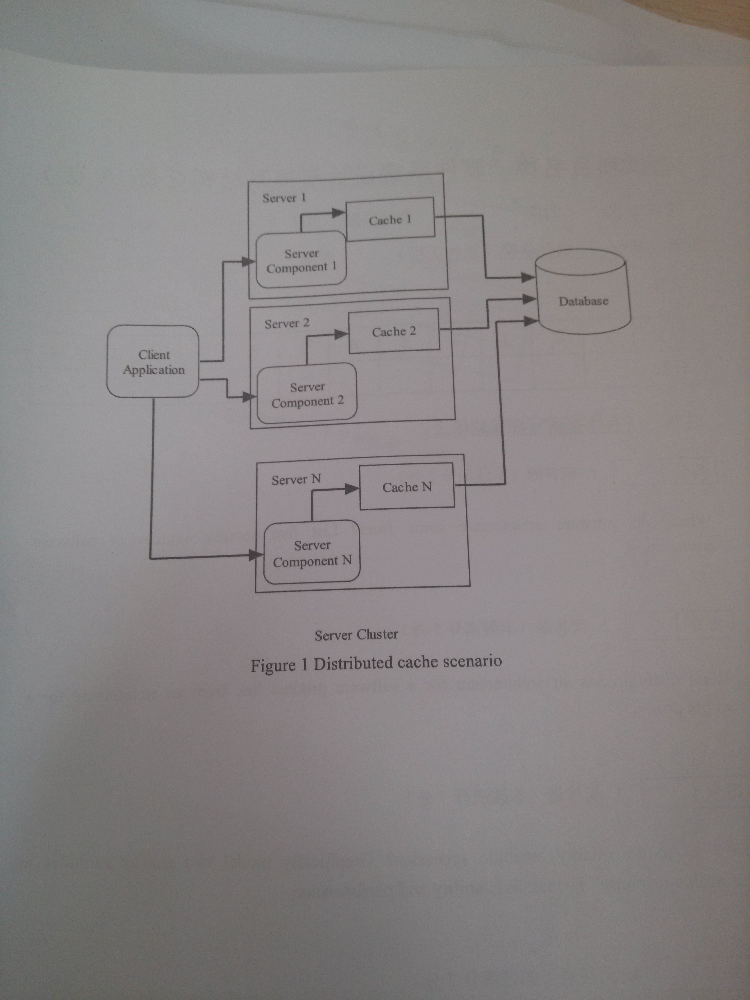

# 设计题

Dstributed Cache Updates. Figure I bclow shows  a dstributed applocation  with caches to improve its runtime performance.  An online  service  system provides its clients access to their Bill Staement infomation (BSI). The database stores BSI for clients.  During a session,a client may require the; BSI several times In order to improve the performance, the BSI information for a particular client is cached. If the cache is loaded, then the BSI can be directly returned back to the client without access to the database. There are N servers clustered to serve the requests from clients. The Server is load-balanced, and each time one server is scheduled for one client request. All the caches on N servers need ti ssynchronize their states. If the client request changes the states od one cache, there are to requirements.

1. The changes are committed to the database.
2. All other cahce states must be invalidated and they should reload the states from the database.

The current design in FIgure 1 cannot meet the second requirement. Some important components are missing. Consider to apply architectural pattern and tactic to the design that can meet the second requirement, and complete the following questions.

1. Identify extra components that is necessary to meet  second requirement. List each component name and it major functionalities.
2. Draw Sequence diagram to illustrate the communication between your devised components and original components in Figure1.
3. Assume that servers are heterogenous, and the protocals to access caches on different servers vary. For example, Server 1 support java RMI invocations to cache 1, Server 2 supports http JSP request to cache2,  and server 3 supports SOAP requests to cache 3. It is further assumed that the cache interfaces are not consistent to each due ti the evolution of the system development and legacy problems. Explain how the concept if connectors or web services can be applied to provide a generic invocation to caches. You can choose either connector or web services for discussion.

